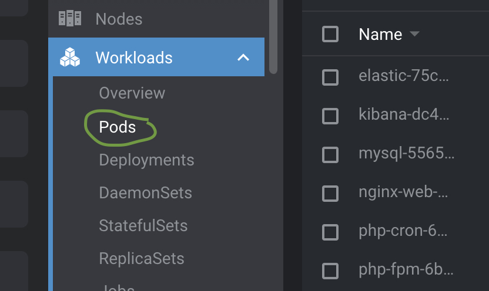
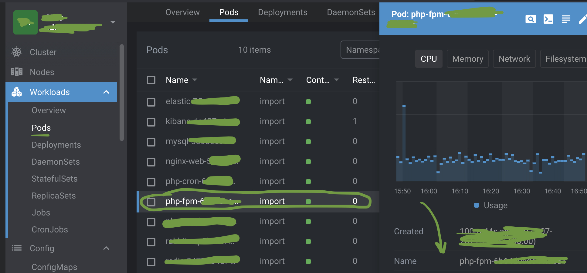
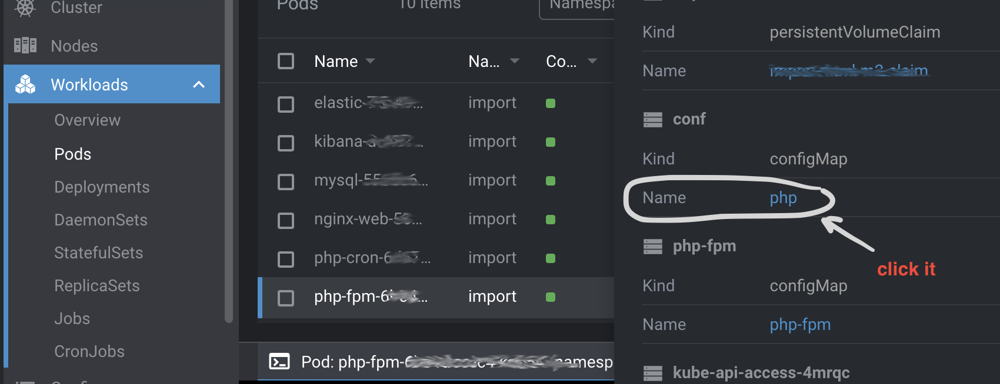
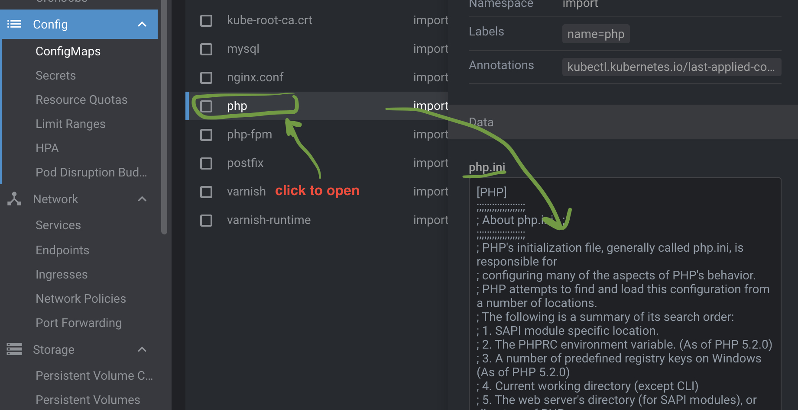
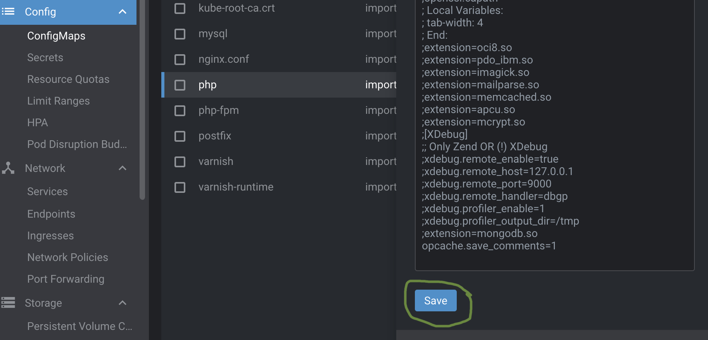
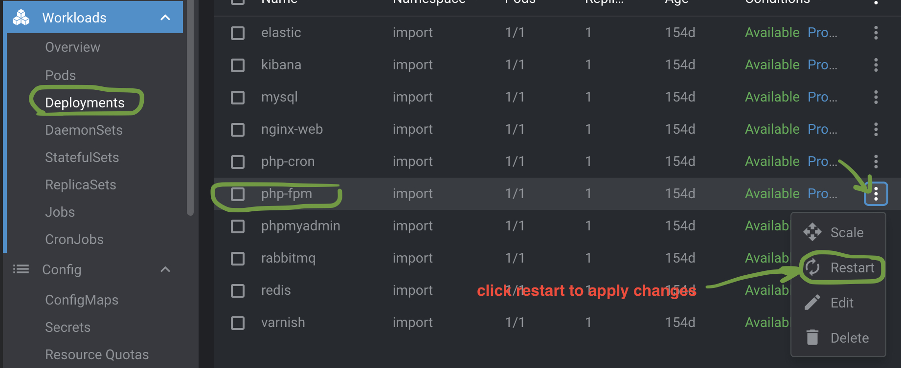
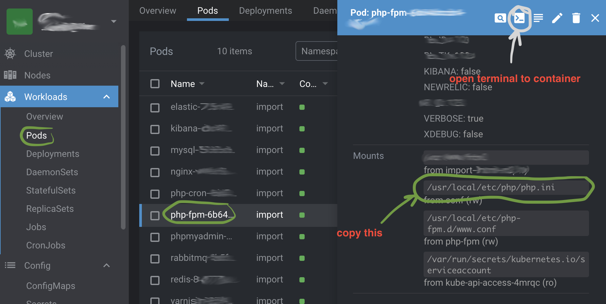

# Docker how to

## Change php.ini and nginx config in docker using kubernetes lens IDE

Navigate to Workloads > Pods in the main menu: 


<br>
<br>
<br>

Find your php-fpm pod where you want to change php.ini, 
in my case it's `php-fpm import` and open it:


<br>
<br>
<br>

Scroll down to the Volumes section and click on link to it's config map:


<br>
<br>
<br>

It will open php.ini so you can edit it like this:



<br>
<br>
<br>

After make changes in php.ini scroll down and save it by clicking save button below:


<br>
<br>
<br>

Then navigate to Deployments, select `php-fpm` and restart it to apply php.ini changes:


<br>
<br>
<br>

After container restarted verify that changes updated.
Navigate back to the Pods and select `php-fpm` pod, then scroll down to Mounts section and copy path to php.ini file (path inside the container):


<br>
<br>
<br>

Then click terminal button at the top blue bar and put the following here:
```
$ nano /usr/local/etc/php/php.ini
```
open the php.ini with `nano` at the folder you just copied from Mounts section.
All changes you have done should be here now.